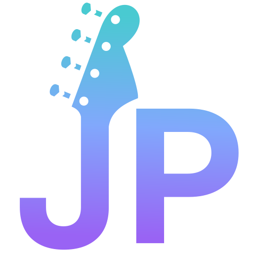
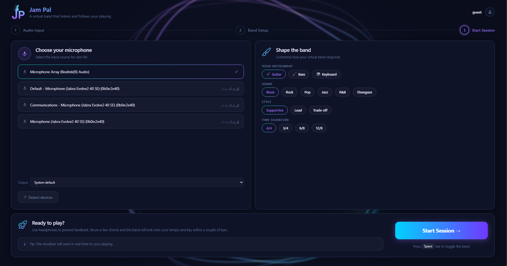
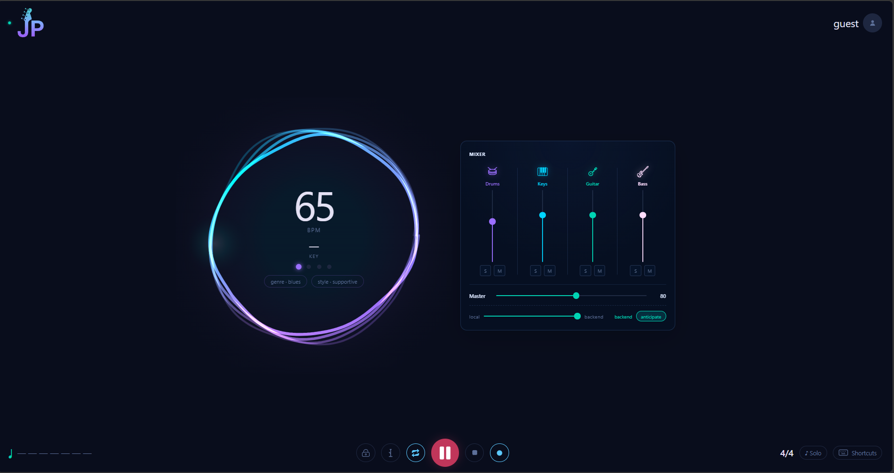
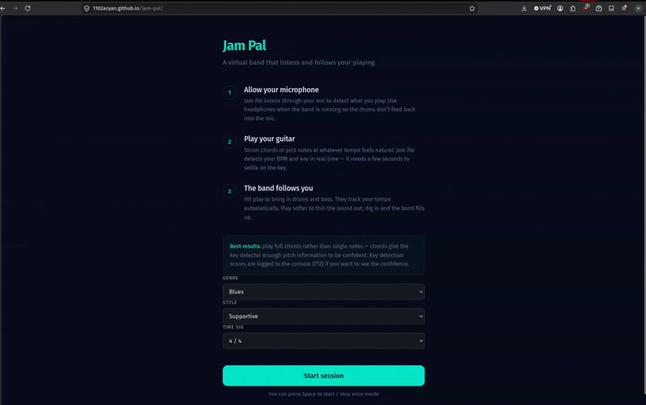

# Jam Pal

Drum and bass to accompany your guitar jam

**[Try Jam Pal](https://1102aryan.github.io/jam-pal/)**

 

## Overview

A real-time jam partner for a beginner guitarist. It listens through the microphone and follows your tempo to match with drums and bass accompaniment that adapts to how you play—by speeding up and slowing down with you. The goal is to build a tool for beginners to practice jamming and build the confidence to jam with real people.

## How it works

1. **Listen** — microphone audio is analysed each frame for energy and spectral flux.
2. **Onsets** — note attacks are detected from spectral flux (chosen over energy because guitar notes sustain rather than spike like a clap).
3. **Tempo** — the spacing between onsets gives a running BPM estimate.
4. **Steadiness** — the variance of recent onset spacing measures how consistent the player is.
5. **Follow** — a look-ahead scheduler plays the accompaniment, easing its tempo toward the player. How *hard* it follows is driven by steadiness: steady playing is tracked closely, unsteady playing is anchored.
6. **Key** — detects the current key of the chord progression.
7. **Real samples** — uses drum samples instead of synthesised drum audio.

The real-time audio (scheduling, sample playback) runs client-side because network latency would break musical timing.

## Screenshots

  

  

## Get Started

View the website through this [link](https://1102aryan.github.io/jam-pal/).

 OR 

1. Clone `https://github.com/1102Aryan/jam-pal`
2. Open the project and run: `cd jam-pal-react`
3. Run: `npm run dev`

## Demo 

  

## Current Features
Here are the features implemented:
- Option between Blues, Pop, Rock, Shoegaze to pick from.
- Breakdowns - drops to one instrument so the player learns to listen and finds when to re-enter.
- Solo space - the band mutes and allows you to lead/solo.
- Call and response - the band plays a phrase, leaves a gap for you to answer.
- Option to record your jam session
- Real instrument sampling and FX
- Metronome + Count-in
- Looper
- Volume control for each instrument
- Time feedback meter

## Status 
The current application is a work in progress and will include these specific features:

- Include more genres (funk, etc)
- Style selection (controls how the tool behaves - support, lead, etc.)
- Anticipation focused model
- Specific animations
- AI analysis 
- Time signature modifications

## Acknowledgements

## License

Distributed under the MIT License. See the `LICENSE` file for more information.

## Contributing

Thanks for visiting this repository. PRs are welcome!

[Report Bug](https://github.com/1102Aryan/jam-pal/issues) • [Request Feature](https://github.com/1102Aryan/jam-pal/issues)

